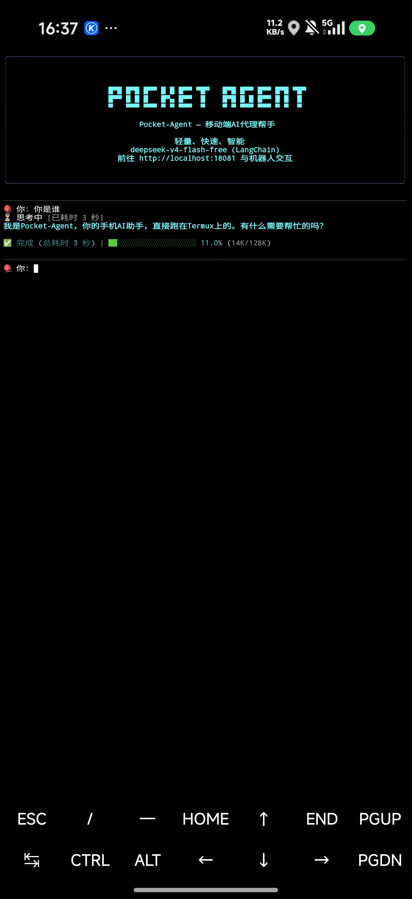
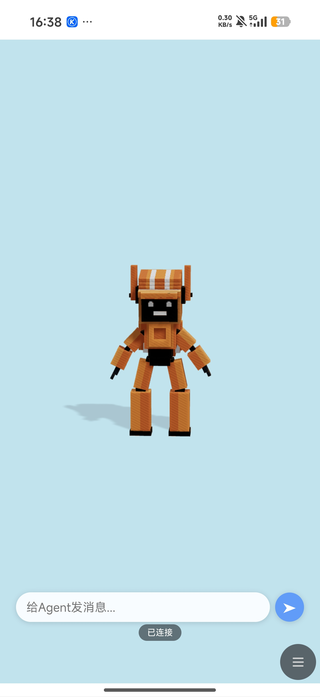
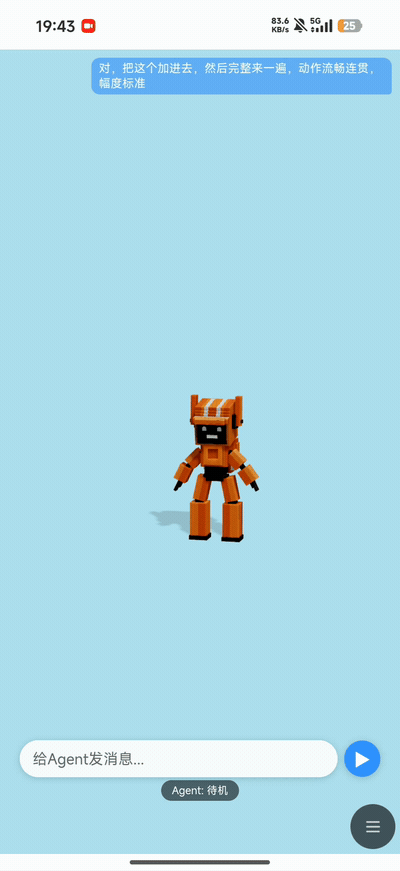

# Pocket-Agent

轻量级移动端 AI Agent，支持在手机（Termux/Android）和服务器上运行。基于 LangChain + LangGraph 构建，支持工具调用、子 Agent 委托、技能系统、分层记忆、MCP 服务和语音播报。

<p align="center">
  
  
  
</p>
<p align="center">
  <em>终端交互模式 &nbsp;|&nbsp; 3D 网页界面 &nbsp;|&nbsp; Agent 自主 3D 动作演示</em>
</p>

## 特性

- **手机自动化控制**：通过 NeuralBridge 协议直接操控安卓设备——点击、滑动、输入、截图、获取 UI 树，可自动执行复杂的多步手机操作任务
- **3D 虚拟身体控制**：Agent 可自主控制 3D 身体模型（挥手、跳舞、点头等），通过提示词实时编排动作，无需预设；配套 Three.js 网页端实时渲染
- **浏览器双向交互**：Agent 通过 SSE 与浏览器页面实时通信，Web 页面可发送消息给 Agent 并接收回复，3D 模型页面也集成聊天入口
- **子 Agent 系统**：主 Agent 可将复杂任务委托给子 Agent 后台异步执行，支持独立模型配置，不阻塞对话
- **分层记忆系统**：用户画像 + 事实记忆 + 事件记忆，基于 FTS5 + 向量搜索 + RRF 融合排序，跨会话持久化
- **技能系统**：自动发现 SKILL.md 知识文档，Agent 按需阅读并按指南执行任务，支持主 Agent、子 Agent、自动沉淀三种技能类型
- **LangChain Agent**：基于官方 `create_agent` 构建，支持中间件链（上下文压缩、模型调用限制等），支持 OpenAI / Ollama / 本地模型
- **持久化对话**：LangGraph MemorySaver 异步 SQLite 存储，重启后恢复历史会话
- **HTTP API**：基于 FastAPI 的 SSE 流式聊天接口，供 Android App 或其他客户端调用

## 快速开始

### 安装依赖

```bash
pip install -r requirements.txt
```

### 配置环境

复制 `.env.example` 为 `.env`，配置以下变量：

```env
# LLM 配置（兼容 OpenAI 格式）
DEFAULT_LLM_BASE_URL=https://api.openai.com/v1
LLM_API_KEY=sk-xxx
LLM_MODEL=gpt-4o

# Embedding 配置（本地 llama-server）
EMBEDDING_SERVER_URL=http://127.0.0.1:8080/v1
EMBEDDING_MODEL=bge-m3
EMBEDDING_MODEL_PATH=/sdcard/Pocket-Agent/bge-m3-Q4_K_M.gguf

# MCP 服务
MCP_SERVER_URL=http://127.0.0.1:7474/mcp
```

### 运行

```bash
# 终端交互模式
python main.py

# HTTP API 模式（供 Android App 调用）
python -m uvicorn app:app --host 0.0.0.0 --port 8000
```

### 嵌入模型（语义检索）

语义检索需要本地 embedding 模型服务。

**前提条件：** 需要编译带 embedding 后端支持的 llama.cpp。

**模型下载：**
```bash
wget -O /sdcard/Pocket-Agent/bge-m3-Q4_K_M.gguf \
  https://hf-mirror.com/gpustack/bge-m3-GGUF/blob/main/bge-m3-Q4_K_M.gguf
```

**手动启动参数：**
```bash
EMBED_MODEL="$(grep '^EMBEDDING_MODEL_PATH=' ~/Pocket-Agent/.env | cut -d= -f2 | tr -d '\"')"
cd ~/llama.cpp && ./build/bin/llama-server \
  -m "$EMBED_MODEL" --embedding -c 8192 --port 8080 --host 0.0.0.0 -np 4 -b 1024 -ub 1024 -t 4
```

> App 启动时会自动读取 `.env` 中的 `EMBEDDING_MODEL_PATH` 并拉起 llama-server。未配置路径或文件不存在时，全文搜索（FTS5）仍可用，语义搜索自动跳过。

## 架构

```
├── app.py                         # FastAPI HTTP 服务（SSE 流式聊天接口）
├── main.py                        # 终端交互式入口
├── agent/
│   ├── agent_langchain.py         # LangChainPocketAgent 核心实现（create_agent + 中间件链）
│   ├── config.py                  # 全局配置
│   ├── embedding.py               # EmbeddingClient + VectorStore（SQLite + numpy）
│   ├── memory.py                  # 用户画像管理（user_profile.md）
│   ├── task_manager.py            # 任务文件系统管理（文件读写的辅助模块）
│   ├── logger.py                  # 结构化日志
│   ├── ui.py                      # 终端 UI（基于 rich 的流式输出、进度条、上下文用量条）
│   ├── tools/
│   │   ├── __init__.py
│   │   ├── basic_tools.py         # 全部内置工具（文件操作、记忆、MCP、子 Agent、TTS 等）
│   │   ├── body_control_tool.py   # 3D 身体控制工具（control_body/move_body/body_script/body_idle）
│   │   ├── body_server.py         # 身体控制 HTTP 服务器（端口 18081，SSE 推送命令到浏览器）
│   │   └── body_viewer.html       # 3D 身体渲染前端（Three.js，浏览器打开即可交互）
│   ├── prompts/
│   │   ├── system_base.py         # 主 Agent 基础人设
│   │   ├── agent_enhance.py       # 主 Agent 工具规则 + 技能系统说明
│   │   ├── executor_system.py     # 子 Agent 系统人设
│   │   └── executor_enhance.py    # 子 Agent 工具规则 + 执行流程
│   └── skills/                    # 技能系统
│       ├── main-skills/           # 主 Agent 技能
│       ├── executor-skills/       # 子 Agent 技能
│       └── auto-skills/           # 自动沉淀的技能
├── memory/                        # 用户画像存储 (user_profile.md)
└── pocket_agent.db                # SQLite 数据库（对话历史 + 向量索引）
```

### Agent Loop 流程

1. `main.py` 加载 `.env` → 创建 `LangChainPocketAgent`（内部初始化 LLM + `create_agent` + 中间件链 + MemorySaver）→ 启动对话循环
2. 用户输入 → `agent.run_conversation()` → LangGraph astream 处理 → 工具调用 / 流式输出 → 返回结果
3. 对话历史通过 LangGraph AsyncSqliteSaver 持久化

### 中间件链

Agent 配置了 5 个中间件按顺序执行：

| 中间件 | 作用 |
|--------|------|
| **MCPToolResultMiddleware** | MCP 返回的图片 base64 转为文本描述，避免 token 爆炸 |
| **ImageOptimizationMiddleware** | 移除历史消息中的图片 base64 数据 |
| **ToolCallIdMiddleware** | 修复某些 LLM（如 GLM 系列）生成的 tool_call 缺少 id 字段 |
| **SummarizationMiddleware** | token 超过 64K 时自动压缩历史，保留最近 20 条 |
| **ModelCallLimitMiddleware** | 单次运行最多调用 MAX_ITERATIONS 次模型，达到后优雅结束 |

## 记忆系统

### 分层架构

| 层级 | 存储 | 用途 |
|------|------|------|
| 用户画像 | `memory/user_profile.md` | 永久性个人信息（姓名、职业、偏好） |
| 事实记忆 | SQLite + 向量索引（跨会话） | 项目决定、技术选型 |
| 事件记忆 | 消息表 + 向量索引（带会话上下文） | 重要事件结果 |

记忆检索使用 **FTS5 全文搜索** + **BGE-M3 向量搜索** + **RRF 融合排序**，确保检索质量。

### 记忆工具

```python
# 存储记忆（importance: 1-10，大部分记忆 3-5 分即可）
save_memory(content="项目使用 SQLite 作为数据库", type="fact", importance=5)

# 检索记忆
search_memory(query="数据库选型", scope="all")

# 更新用户画像
update_user_profile(section="偏好设置", content="喜欢简洁的回答风格")
```

### 记忆判断规则

- **用户画像**：换了项目/场景仍然成立（姓名、职业、永久偏好）
- **事实记忆**：跟具体项目/任务相关（技术决定、工作上下文）
- **事件记忆**：重要事件结果（部署成功、问题解决）
- **不记忆**：普通闲聊、工具执行细节

## 工具列表

| 工具 | 功能 |
|------|------|
| `file_read` | 读取文件内容 |
| `file_write` | 写入或追加文件内容 |
| `file_search` | 搜索文件内容（支持正则） |
| `directory_list` | 列出目录内容 |
| `system_info` | 获取系统信息 |
| `shell_exec` | 执行 shell 命令 |
| `update_user_profile` | 更新用户画像 |
| `save_memory` | 保存事实/事件记忆 |
| `search_memory` | 检索记忆（FTS5 + 向量） |
| `mcp_call` | 调用 MCP 服务 |
| `tts_speak` | 语音播报 |
| `delegate_task` | 委托子 Agent 执行独立任务 |
| `control_body` | 控制 3D 虚拟身体部位旋转（点头、举手、弯腰等） |
| `move_body` | 移动 3D 虚拟身体整体位置（蹲下、跳跃、前进等） |
| `body_script` | 执行动作脚本序列，适合跳舞等连续动作 |
| `body_idle` | 恢复 3D 身体待机状态 |

## 子 Agent 系统

主 Agent 可通过 `delegate_task` 将独立任务委托给子 Agent 执行。

- 子 Agent 默认与主 Agent 共用模型，也可通过环境变量独立配置（`EXECUTOR_LLM_BASE_URL` 等）
- 子 Agent 拥有独立的系统提示词（`agent/prompts/executor_system.py` + `executor_enhance.py`）
- 子 Agent 技能存放在 `agent/skills/executor-skills/`，主 Agent 技能存放在 `agent/skills/main-skills/`
- 子 Agent 执行结果自动返回主 Agent，执行过程通过任务文件（`/tmp/agent_task_*.json`）管理

## 3D 身体控制

Pocket-Agent 内置了基于 Three.js 的 3D 虚拟身体控制系统，Agent 可以通过工具控制身体各部位旋转和位移，实现挥手、点头、跳舞、蹲下等动作。

### 快速体验

```bash
# 启动 Agent（自动在 18081 端口启动身体控制服务器）
python main.py

# 在浏览器打开
# http://<手机IP>:18081/  → 3D 身体渲染界面
# 手机浏览器访问 localhost:18081 即可
```

### 控制方式

| 工具 | 作用 |
|------|------|
| `control_body(part, x, y, z)` | 控制单个部位旋转（头部、手臂、腿、躯干等 12 个部位） |
| `move_body(x, y, z)` | 移动身体整体位置（左右/上下/前后） |
| `body_script(moves)` | 执行 JSON 动作脚本序列，适合跳舞等连续动作 |
| `body_idle()` | 恢复待机状态 |

### 浏览器交互

Web 页面支持双向通信：
- **SSE 推送**：Agent 的身体控制指令实时推送到页面，3D 模型同步动作
- **消息输入**：页面上的输入框可发送消息给 Agent，Agent 的回复也会实时显示在页面上
- **响应流**：Agent 回复内容通过 SSE 实时推送到浏览器

## 技能系统

### 技能目录结构

```
agent/skills/
├── main-skills/           # 主 Agent 技能
│   ├── dev/               # 开发相关技能
│   │   ├── brainstorming/
│   │   ├── code-review/
│   │   ├── systematic-debugging/
│   │   ├── test-driven-development/
│   │   ├── verification-before-completion/
│   │   ├── writing-plans/
│   │   └── skill-creator/
│   └── phone/             # 手机操控技能
│       └── phone-control-quickref/
├── executor-skills/       # 子 Agent 技能
│   ├── fast-mode/
│   ├── neuralbridge-operation-standard/
│   ├── phone-control-guide/
│   └── skill-creator/
└── auto-skills/           # 自动沉淀的技能
    ├── main/              # 主 Agent 操作流程
    └── executor/          # 子 Agent 操作流程
```

### 技能自动发现

Agent 启动时自动扫描 `main-skills/` 和 `executor-skills/` 目录，将技能名称和描述注入系统提示词，模型可在对话中按需读取 `SKILL.md` 并按指南操作。

## HTTP API

### 聊天（SSE 流式）

```bash
curl -X POST http://localhost:8000/chat \
  -H "Content-Type: application/json" \
  -d '{"message": "你好", "conversation_id": "test-123"}'
```

### 消息搜索

```bash
# FTS5 关键词搜索
curl "http://localhost:8000/conversations/test-123/search?q=数据库"

# 跨会话搜索
curl "http://localhost:8000/conversations/_/search?q=SQLite&cross_session=true"

# 向量语义搜索
curl "http://localhost:8000/messages/vector_search?q=数据库选型"
```

### 保存记忆

```bash
curl -X POST http://localhost:8000/memory/save \
  -H "Content-Type: application/json" \
  -d '{"content": "项目使用 SQLite", "type": "fact"}'
```

### 删除消息

```bash
# 删除单条消息
curl -X DELETE "http://localhost:8000/messages/{message_id}"
```

## 配置说明

### agent/config.py

| 配置项 | 默认值 | 说明 |
|--------|--------|------|
| `MAX_ITERATIONS` | 300 | 最大工具调用轮数 |
| `RECURSION_LIMIT` | 600 | LangGraph 递归限制（建议设为 MAX_ITERATIONS 的 2 倍） |
| `MAX_CONTEXT_TOKENS` | 128000 | 上下文窗口大小 |

### 环境变量

| 变量 | 说明 |
|------|------|
| `DEFAULT_LLM_BASE_URL` | LLM API 地址（兼容 OpenAI 格式） |
| `LLM_API_KEY` | API 密钥 |
| `LLM_MODEL` | 模型名称 |
| `LLM_TEMPERATURE` | 生成温度（默认 0.7） |
| `LLM_MAX_TOKENS` | 单次生成最大 token 数（默认 8000） |
| `EXECUTOR_LLM_BASE_URL` | 子 Agent LLM 地址（可选，默认与主 Agent 共用） |
| `EXECUTOR_API_KEY` | 子 Agent API 密钥 |
| `EXECUTOR_MODEL` | 子 Agent 模型名称 |
| `EMBEDDING_SERVER_URL` | 本地 embedding 服务地址（默认 localhost:8080） |
| `EMBEDDING_MODEL` | Embedding 模型名称 |
| `EMBEDDING_MODEL_PATH` | GGUF 模型文件绝对路径，App 据此自动拉起 llama-server |
| `EMBEDDING_BASE_URL` | 远程 Embedding API 地址（使用远程服务时填写） |
| `EMBEDDING_API_KEY` | 远程 Embedding API 密钥 |
| `MCP_SERVER_URL` | MCP 服务地址 |

## 依赖

- Python 3.10+
- LangChain / LangGraph
- numpy（向量计算）
- FastAPI / Uvicorn / SSE-Starlette（HTTP 服务）
- aiosqlite（异步 SQLite）
- rich（终端 UI）
- prompt_toolkit（输入增强）
- Pillow / pytesseract（OCR 兜底）
- geopy（坐标处理）
- psutil（系统信息）

## 许可证

MIT
